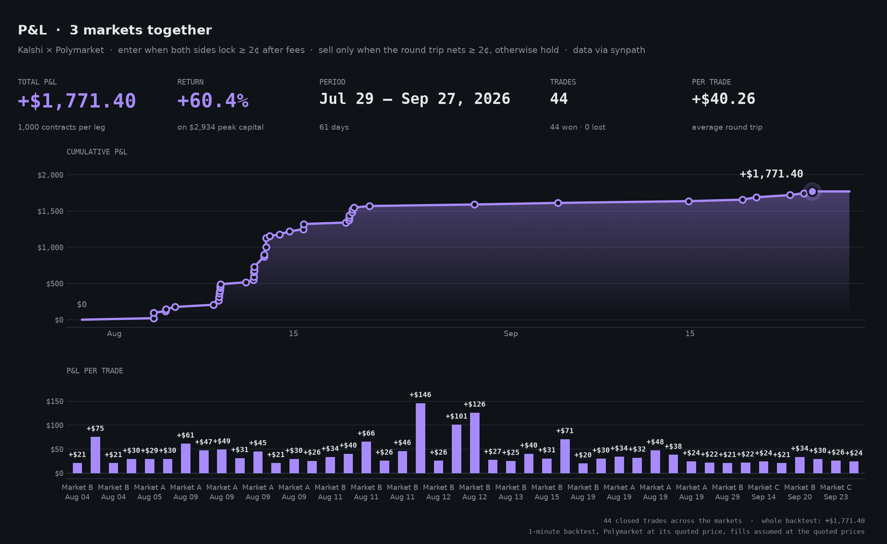

# Prediction Market Arbitrage Trading Bot

[](https://www.synpath.dev)
[](https://github.com/Synpath-ai/synpath)


An open-source arbitrage strategy for **Kalshi** and **Polymarket**: it finds arbitrage opportunities, runs the strategy on live prices as paper trading, and backtests it on history. No orders are placed.

⭐ **Find it useful? Star [this repo](https://github.com/Synpath-ai/prediction-market-arbitrage-trading-bot) and [Synpath](https://github.com/Synpath-ai/synpath).** It's how other traders find them.

### ⚡ Powered by [Synpath](https://www.synpath.dev): one API for every prediction market

Kalshi, Polymarket, Polymarket US and Opinion through one open-source Python SDK:

- **Smart order routing** across both order books, at the cheapest price after fees
- **Advanced order types:** stop-limit, trailing stop, OCO, TWAP and more, on every venue
- **Cross-venue market matching**, with settlement rules compared
- **Unified data:** order books, fees, live streams and history

Open source (MIT): **[github.com/Synpath-ai/synpath](https://github.com/Synpath-ai/synpath)** · `pip install synpath`

> [!WARNING]
> **Not financial advice. For research and educational purposes only.**
> This project does not place trades and makes no promise of profit. Backtest and paper-trading results are simulated and do not predict real returns. Read the full [Disclaimer](#disclaimer) before using it.

---

## Overview

Kalshi and Polymarket often list the same question at different prices. When that happens, buying **YES on one platform** and **NO on the other** can cost less than the $1 the pair always pays out. That difference is the arbitrage profit.

```
Profit per pair = $1.00 − (YES price + NO price) − trading fees
```

This bot:

- **Matches markets** across both platforms and checks that they settle under the same rules
- **Detects arbitrage opportunities** from live order books, after fees
- **Signals entries and exits** and tracks paper positions and P&L at the quoted prices
- **Backtests** the same strategy on historical prices and charts the results



*Backtest of the strategy on three markets listed on both platforms: 60 days of hourly prices, 1,000 contracts per leg. **+$863.80 total P&L, a +29.4% return** on the $2,933 peak capital tied up at once, across 20 trades, every one closed at a profit. Produced with `python -m backtest.backtest` and `python -m backtest.charts --generic-names`.*

## How Cross-Platform Arbitrage Works

Polymarket and Kalshi sometimes price the same event differently.

The bot looks for cases where it can buy **YES on one platform** and **NO on the other** for a combined cost of less than $1.

Because exactly one side will pay $1 at settlement, buying both sides below $1 creates a built-in profit.

### Simple example

Suppose:

- YES on Kalshi = **39¢**
- NO on Polymarket = **55¢**

Buying both costs **94¢**. After fees, the total cost is about **96.7¢**.

At settlement, one of the two positions will pay **$1**, so the trade locks in roughly **3.3¢ profit per contract pair**. On 1,000 contracts, that's about **$33**.

### The bot doesn't always need to wait

If the price difference disappears before the event settles, the bot can close both positions early and take the profit.

For example, if the two positions can later be sold for a combined **$1.02**, that's about **2.6¢ profit per pair after fees** (about $26 on 1,000 contracts). The bot exits and frees up the capital for the next opportunity.

If prices don't converge, it simply holds until settlement and collects the spread it locked in at entry.

### In short

**Find the same event priced differently → buy both sides for less than $1 → exit when profitable or hold to settlement.**

The bot automates this process across Polymarket and Kalshi.

## Arbitrage Strategy

Three simple rules:

1. **Buy** when YES on one platform plus NO on the other costs at least **2¢ less than $1**, after fees.
2. **Sell** both sides as soon as selling them makes at least **2¢ profit** per pair, after fees.
3. **Otherwise hold** until settlement, where the pair pays $1 and the profit locked in at entry is collected.

So the strategy **never sells at a loss**. YES and NO are always bought in the same quantity, so the position stays balanced, and the size is limited to what's available at the best price on each platform.

Both 2¢ thresholds can be changed in `config.py` (`entry_edge` and `take_profit`).

## Setup

### 1. Install

Requires Python 3.10+.

```bash
git clone https://github.com/Synpath-ai/prediction-market-arbitrage-trading-bot
cd prediction-market-arbitrage-trading-bot
python3 -m venv .venv && source .venv/bin/activate
pip install -r requirements.txt
```

### 2. Add your Synpath API key

```bash
cp .env.example .env        # then set SYNPATH_API_KEY
```

Get a key at [synpath.dev](https://www.synpath.dev). It's used for market matching, live prices and history. No exchange accounts or trading keys are needed.

### 3. Find markets

```bash
python -m src.discover --save
```

This finds the **10 markets with the best arbitrage profit available right now** (after fees), among markets listed on both Kalshi and Polymarket that settle under the same rules, and saves them to `markets.json`. The bot and the backtest use them automatically. It reads live prices for every candidate, so it can take a minute.

Change what it picks with `--limit 20`, `--sort gap` (largest price difference right now) or `--sort volume` (most traded), and narrow the search with `--query "senate"` or `--domain election`.

### 4. Set the strategy

Adjust the rest of `config.py` to taste:

| Option | Description | Default |
|---|---|---|
| `entry_edge` | Minimum profit per $1 pair, after fees, to enter | `0.02` |
| `take_profit` | Minimum round-trip profit per pair to exit | `0.02` |
| `contracts` | Contracts per leg (capped by available liquidity) | `1000` |
| `require_same_rules` | Only trade markets whose rules match | `True` |
| `poll_interval_seconds` | Seconds between price checks | `60` |

## Finding Arbitrage Opportunities

The bot doesn't ship with any markets preselected. Use the discovery tool to list markets that trade on both platforms:

```bash
python -m src.discover                        # 10 markets with the best profit right now
python -m src.discover --sort volume --limit 5  # most traded
python -m src.discover --query "senate" --save  # search by keyword and save
```

Market matching is done by Synpath, not by comparing titles. Each matched market comes with a rule check:

- **`same`**: both platforms settle the market the same way. These are the only markets used by default.
- **`insufficient`**: one platform's rules don't state every detail.
- **`not_same`**: the markets can settle differently, so it is **not** an arbitrage. Never used.

Add `--save` to keep the `same` markets in `markets.json`, which the bot and backtest then use. To pick markets by hand instead, list them in `config.py` or pass `--market EVENT_ID KALSHI_ID`.

## Usage

```bash
python -m src.main                                      # every saved market
python -m src.main --market <event_id> kalshi:<TICKER>  # a single market
```

Every poll, the bot reads both platforms' live order books, prices both combinations, and prints what the strategy does: an **entry** signal opens a paper position at the quoted prices, an **exit** signal closes it at the bids and records the profit, and otherwise it reports the position being held. Paper positions are saved to `state/positions.json`, so they carry over after a restart, and every completed trade is recorded in `state/trades.csv`.

## Backtesting

```bash
python -m backtest.backtest --days 60
python -m backtest.charts
python -m backtest.charts --market kalshi:<TICKER> --start YYYY-MM-DD --end YYYY-MM-DD
```

The backtest runs the same strategy code on hourly price history and reports the trades and P&L for each market. The charts show, for each market:

- **Prices:** both platforms' prices, with the spread shaded and every entry and exit marked
- **P&L:** cumulative P&L, with the profit of each trade

Options: `--by-close` counts trades by the date they closed, `--best` shows each market's best run of consecutive trades, and `--generic-names` labels markets as Market A, B, C for sharing.

## Project Layout

```
prediction-market-arbitrage-trading-bot/
├── config.py            # Markets, strategy parameters, position size
├── src/
│   ├── main.py          # Entry point
│   ├── bot.py           # Live strategy loop, paper positions and trades
│   ├── strategy.py      # Entry and exit rules
│   ├── arbitrage.py     # Arbitrage pricing, fees, profit calculation
│   ├── matcher.py       # Cross-platform market matching and rule check
│   └── discover.py      # Finds markets listed on both platforms
├── backtest/
│   ├── data.py          # Historical prices
│   ├── backtest.py      # Strategy simulation
│   └── charts.py        # Entry/exit and P&L charts
└── tests/               # Offline unit tests
```

## Powered by Synpath

[](https://www.synpath.dev)
[](https://github.com/Synpath-ai/synpath)

This bot is built on **[Synpath](https://www.synpath.dev)**, one API for every prediction market. It uses Synpath's cross-venue market matching, live order books, fee schedules and price history.

Synpath does much more than this bot needs:

| | |
|---|---|
| **Venues** | Kalshi, Polymarket, Polymarket US and Opinion, through one SDK |
| **Smart order routing** | One order across Kalshi and Polymarket, filled from the cheapest price after fees |
| **Advanced order types** | Stop, stop-limit, trailing stop, iceberg, OCO, bracket, TWAP and peg on every venue |
| **Market matching** | The same market on every platform, with settlement rules compared |
| **Data** | Unified order books, trades, fees, live streams and tick-level Kalshi order book history |
| **Execution engine** | Orders journaled before sending, pre-trade risk rules, crash-safe restarts |

Get an API key at **[synpath.dev](https://www.synpath.dev)**. The Synpath SDK is open source (MIT) at **[github.com/Synpath-ai/synpath](https://github.com/Synpath-ai/synpath)**.

## Disclaimer

**Read this before using this project.**

- **Not financial advice.** Nothing in this repository is investment, financial, legal or tax advice, or a recommendation to buy or sell anything.
- **Educational and research use only.** The code is provided to demonstrate a strategy, not as a trading product.
- **No trading.** The bot only paper trades: it records simulated positions at quoted prices and never places real orders.
- **Simulated results.** Backtest and paper-trading results use historical or quoted prices and assume every order fills at those prices. Real trading involves slippage, partial fills, delays and liquidity limits, and results can be very different. Past performance does not predict future results.
- **No guarantee of profit.** "Locked-in" profit depends on both platforms settling the market the same way. Rules can differ, markets can be disputed or voided, and you can lose money.
- **Check the rules where you live.** Prediction markets are restricted or prohibited in some jurisdictions. You are responsible for complying with the laws that apply to you and with each platform's terms of service.
- **Not affiliated.** This project is not affiliated with, endorsed by, or sponsored by Kalshi or Polymarket.
- **Use at your own risk.** The software is provided "as is", without warranty of any kind (see the MIT license). The authors are not liable for any loss arising from its use.

## License

MIT
