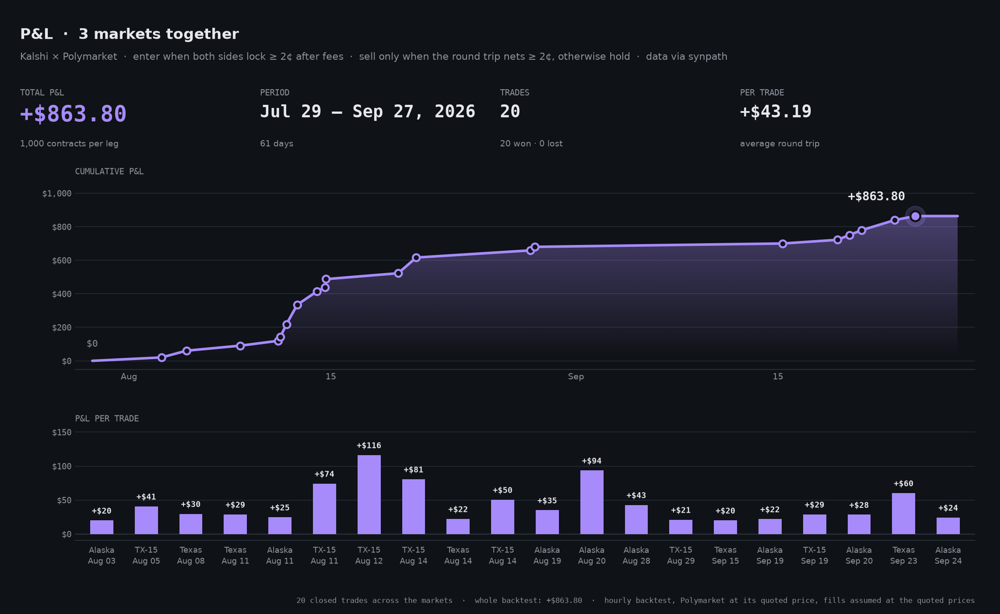
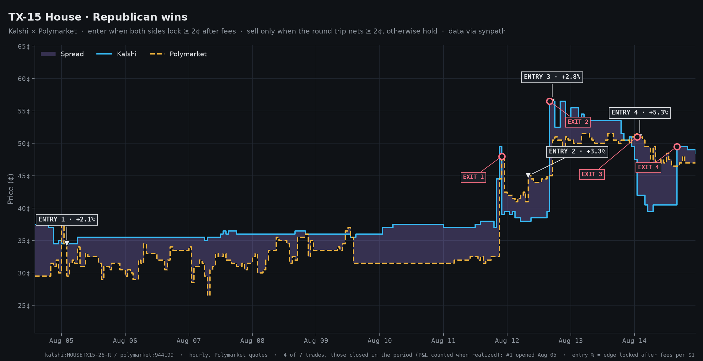
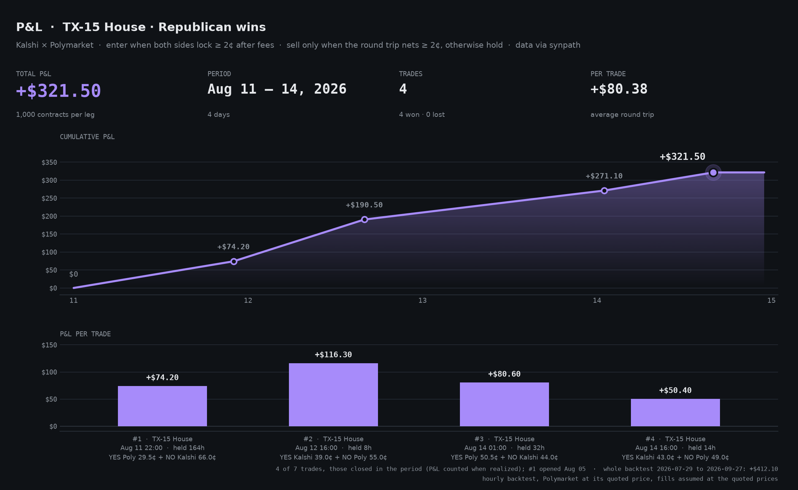
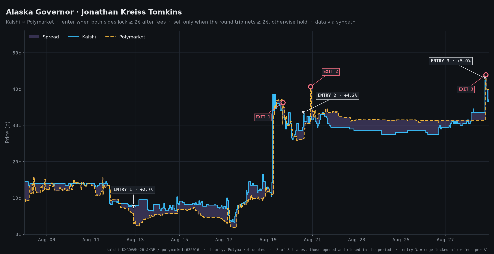
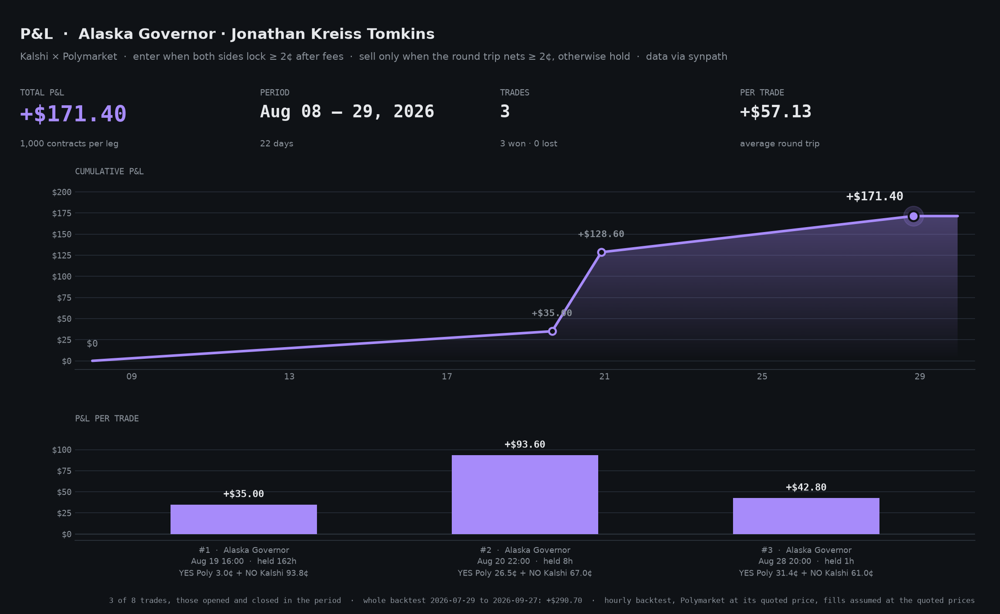

# Disclaimer: Not financial advice. Educational purposes only.

# Prediction Market Arbitrage Trading Bot

A bot that trades the price gap between Kalshi and Polymarket on the same market, and a backtest of the same rule. Built with [Synpath](https://www.synpath.dev), one API for prediction markets: matched markets, order books, fee schedules, history and order entry on both venues.



## What It Trades

The same question often trades at different prices on the two venues. Buying YES on the cheaper venue and NO on the other costs less than the $1 the pair pays out whichever way the question resolves, so the difference is locked in at entry.

**Example:**
- Kalshi: YES = 39¢
- Polymarket: NO = 55¢ (its YES is 45¢)
- **Total cost: 94¢**, plus taker fees on both venues (2.7¢ at 1,000 contracts)
- **Pays out: $1** whatever happens
- **Locked: 3.3¢ per pair**, $33.40 at 1,000 contracts

The bot does not wait months for the question to resolve. The gap between the venues keeps opening and closing, and the pair can usually be sold back for more than it cost well before resolution.

## Strategy

| | Rule |
|---|---|
| **Entry** | Buy YES on one venue and NO on the other when, after both venues' taker fees, the pair costs at least **2¢** less than $1 (`entry_edge`). |
| **Exit** | Sell both legs only when the round trip nets at least **2¢** after fees on both sides (`take_profit`). |
| **Otherwise** | Hold. Both legs together pay exactly $1 at resolution, so a position that never reaches the target still makes the edge it locked at entry. **It never sells at a loss.** |
| **Size** | The same number of YES and NO contracts, so the pair is hedged; never more than the size quoted at the best price on either leg. |
| **Markets** | Only pairs whose rules settle alike (see Market Matching). One position per market at a time. |

## Backtest

60 days of hourly history (Jul 29 – Sep 27, 2026), three state races, 1,000 contracts per leg, `python -m backtest.backtest`:

| Market | Trades | Won | P&L |
|---|---|---|---|
| Alaska Governor · Jonathan Kreiss Tomkins | 8 | 8 | +$290.70 |
| TX-15 House · Republican wins | 7 | 7 | +$412.10 |
| Texas Governor · Republican wins | 5 | 5 | +$161.00 |
| **Total** | **20** | **20** | **+$863.80** |

A pair costs just under $1, so each entry at 1,000 contracts uses about $980, split between the two venues (about $3,000 at most with all three markets open).

### TX-15 House, Aug 11 – 14




### Alaska Governor, Aug 8 – 29




Each ENTRY tag shows the edge the pair locked after fees, per $1. ENTRY n / EXIT n on the price chart is bar #n on the P&L chart. Both periods count the trades that closed inside them (P&L counted when realized), so a trade opened earlier is included and the footnote says when it opened (TX-15 #1 opened Aug 5, Alaska #1 Aug 7).

**Read the backtest with its limits:**
- Hourly data: the bot checks every minute, the backtest once an hour.
- Polymarket publishes no historical order book, so its price is used as both bid and ask. A real 1¢ spread costs about half a cent per Polymarket leg that the backtest does not charge. (The live bot trades Polymarket's real book.)
- Fills are assumed at the quoted price for the full size; order book depth on these markets is often tens to a few hundred contracts.
- Holding can be long: some positions waited more than a week for the target.

## Quick Start

### 1. Install

```bash
python3 -m venv .venv && source .venv/bin/activate
pip install -r requirements.txt
```

### 2. Configure Markets

Edit `config.py`:

```python
CONFIG = {
    "markets": [
        {"event": "737088c1-d043-4ae8-bf24-d0194bb4818a", "kalshi": "kalshi:HOUSETX15-26-R"},  # TX-15 House
    ],
    "entry_edge": 0.02,     # enter when the pair locks >= 2c after fees
    "take_profit": 0.02,    # sell when the round trip nets >= 2c
    "contracts": 1000,
    "dry_run": True,
}
```

A market is a Kalshi listing and its event on Synpath (`https://www.synpath.dev/events/<event>`).

### 3. Set Up Credentials (only for live trading)

```bash
cp .env.example .env
```

Fill in your Kalshi API key and your Polymarket wallet. Orders go from your machine straight to the venues; Synpath never sees your keys.

### 4. Run

```bash
python -m src.main           # dry run: live prices and decisions, no orders
python -m src.main --live    # sends orders
```

Backtest and charts:

```bash
python -m backtest.backtest --days 60
python -m backtest.charts --market kalshi:HOUSETX15-26-R --start 2026-08-11 --end 2026-08-14 --by-close
python -m backtest.charts --market kalshi:KXGOVAK-26-JKRE --start 2026-08-08 --end 2026-08-29 --by-close
```

## How It Works

### 1. Market Matching
No fuzzy name matching. `synpath.match_market("kalshi:...")` returns the Polymarket listing of the same proposition and whether Polymarket states it the other way round. The bot then reads Synpath's comparison of the two venues' rules and only trades pairs compared as `same`. A pair that settles differently (another resolution source, an extra condition) is not an arbitrage, because YES + NO no longer always pays $1.

### 2. Pricing
Every poll reads both venues' live order books. Both combinations are priced at what a taker actually pays: YES at its ask, NO at 1 − the YES bid, plus each venue's published taker fee (Kalshi 0.07 × P × (1 − P) rounded up to the cent per order, Polymarket 0.04 × P × (1 − P)).

### 3. Entry
When the better combination locks at least `entry_edge`, both legs go out together as immediate-or-cancel limit orders at the quoted prices, so nothing rests on the book and nothing fills worse. If one leg fills more than the other, the excess is sold straight back, so the bot only ever holds matched pairs.

### 4. Exit
Each poll prices selling both legs at the bids. Once that round trip nets at least `take_profit` after fees, both legs are sold. Until then the position is held, and it is never sold at a loss.

Open positions are saved to `state/positions.json`, so a restart resumes them, and every round trip is appended to `state/trades.csv`.

## Configuration Options

| Option | Description | Default |
|---|---|---|
| `markets` | Kalshi listings and their Synpath events | three state races |
| `entry_edge` | Profit the pair must lock after fees to enter, per $1 | `0.02` |
| `take_profit` | Round-trip profit that triggers the exit, per $1 | `0.02` |
| `contracts` | Contracts per leg (capped by the depth at the best price) | `1000` |
| `require_same_rules` | Trade only pairs whose rules compare as `same` | `True` |
| `poll_interval_seconds` | How often to check prices | `60` |
| `dry_run` | Log decisions without sending orders | `True` |

## Example Output

```
[BOT STARTED] DRY RUN · enter when both sides lock ≥ 2¢ after fees · sell only when the round trip nets ≥ 2¢, otherwise hold · 1000 contracts · every 60s

[PAIR] Alaska Governor · Jonathan Kreiss Tomkins: kalshi:KXGOVAK-26-JKRE <-> polymarket:635016 · rules same
[PAIR] TX-15 House · Republican wins: kalshi:HOUSETX15-26-R <-> polymarket:944199 · rules same
[PAIR] Texas Governor · Republican wins: kalshi:GOVPARTYTX-26-R <-> polymarket:629691 · rules same

[2026-09-27 12:25:00 UTC]
[Alaska Governor · Jonathan Kreiss Tomkins] Kalshi 75.0¢/77.0¢ · Polymarket 77.1¢/78.3¢ · best edge -1.8¢
[TX-15 House · Republican wins] Kalshi 26.0¢/27.0¢ · Polymarket 23.0¢/24.0¢ · best edge -0.1¢
[Texas Governor · Republican wins] Kalshi 78.0¢/79.0¢ · Polymarket 80.1¢/80.5¢ · best edge -0.7¢
```

When a pair clears the entry edge:

```
[ENTER] TX-15 House · Republican wins: YES kalshi 39.0¢ + NO polymarket 55.0¢ = 94.0¢ + fees 2.7¢ · locks 3.3¢/pair · 1000 contracts
   [DRY RUN] kalshi buy 1000 @ YES 0.39 on kalshi:HOUSETX15-26-R
   [DRY RUN] polymarket sell 1000 @ YES 0.45 on polymarket:944199
   [OPEN] 1000 pairs held; worst case at resolution +$33.40
```

## Project Structure

```
prediction-market-arbitrage-trading-bot/
├── config.py              # Markets, strategy and size
├── .env.example           # Venue credentials template
├── requirements.txt
├── src/
│   ├── main.py            # Entry point
│   ├── bot.py             # Live loop: books, entries, exits, orders, saved state
│   ├── strategy.py        # The entry and exit rule (shared with the backtest)
│   ├── arbitrage.py       # Pricing both combinations, fees, round trips
│   └── matcher.py         # Same market on both venues, and whether the rules match
├── backtest/
│   ├── data.py            # Hourly history through synpath
│   ├── backtest.py        # The strategy on history
│   └── charts.py          # Entry/exit and P&L charts
├── tests/                 # Offline tests: pricing, strategy, backtest, bot orders
└── assets/                # Charts used in this README
```

## Disclaimer

This is an educational project.

- Both legs go out at once, but they fill independently: prices can move between them, and a leg can fill partly.
- Order book depth on these markets is limited; large sizes will not fill at the quoted price.
- A pair only pays $1 if both venues resolve the question the same way. The bot checks Synpath's rule comparison, but read both venues' rules yourself before trading.
- Positions can be held until the question resolves, which for elections is months away.
- Use at your own risk.

## Built With

- [Synpath](https://www.synpath.dev) - One API for prediction markets: matching, order books, fee schedules, history, order entry
- Python 3.10+

# Disclaimer: Not financial advice. Educational purposes only.

## License

MIT
