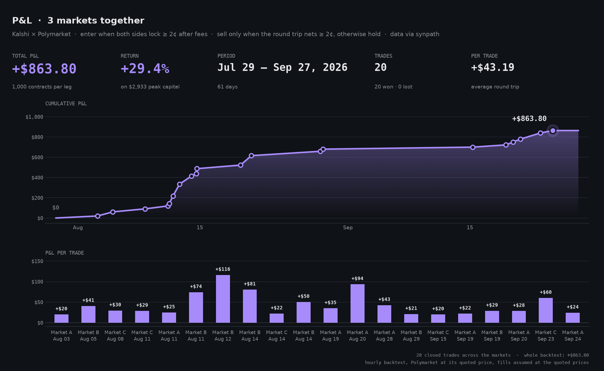

# Prediction Market Arbitrage Trading Bot

An open-source arbitrage strategy for **Kalshi** and **Polymarket**: it finds arbitrage opportunities, runs the strategy on live prices as paper trading, and backtests it on history. No orders are placed. Built on [Synpath](https://www.synpath.dev), a unified API for prediction markets.

> **Disclaimer:** Not financial advice. For research and educational purposes only.

---

## Overview

Kalshi and Polymarket often list the same question at different prices. When that happens, buying **YES on one platform** and **NO on the other** can cost less than the $1 the pair always pays out. That difference is the arbitrage profit.

```
Profit per pair = $1.00 − (YES price + NO price) − trading fees
```

This bot:

- **Matches markets** across both platforms and checks that they settle under the same rules
- **Detects arbitrage opportunities** from live order books, after fees
- **Signals entries and exits** and tracks paper positions and P&L at the quoted prices
- **Backtests** the same strategy on historical prices and charts the results



*Backtest of the strategy on three markets listed on both platforms: 60 days of hourly prices, 1,000 contracts per leg. **+$863.80 total P&L, a +29.4% return** on the $2,933 peak capital tied up at once, across 20 trades, every one closed at a profit. Produced with `python -m backtest.backtest` and `python -m backtest.charts --generic-names`.*

## How Cross-Platform Arbitrage Works

Every prediction market contract pays **$1** if its outcome happens and **$0** if not. So if you hold **YES on one platform and NO on the other** for the same outcome, exactly one of them pays out: the pair is worth $1 no matter what happens.

The two platforms don't always agree on the price. When they disagree by enough, you can buy that $1 pair for less than $1. The strategy doesn't have to wait for the market to resolve to collect: as the two prices move back toward each other, the pair can often be sold early for more than it cost.

**Example** (1,000 contracts, fees included):

| | Kalshi | Polymarket |
|---|---|---|
| Price of YES | 39¢ | 45¢ |
| Price of NO | 62¢ | 55¢ |

**1. Entry: Kalshi's YES is cheaper**

| | |
|---|---|
| Buy YES on Kalshi | 39¢ |
| Buy NO on Polymarket | 55¢ |
| **Total cost** | **94¢** |
| Trading fees (both platforms) | 2.7¢ |
| **Payout at resolution** | **100¢** |
| **Profit locked in** | **3.3¢ per pair ($33 on 1,000 contracts)** |

**2. Exit: the prices converge**

A day later Kalshi's YES has risen to 48¢ and Polymarket's YES to 46¢, so Polymarket's NO is now 54¢.

| | |
|---|---|
| Sell YES on Kalshi | 48¢ |
| Sell NO on Polymarket | 54¢ |
| **Received** | **102¢** |
| Profit after fees on both trades | **2.6¢ per pair ($26 on 1,000 contracts)** |

That clears the 2¢ `take_profit`, so the strategy sells: $26 made in a day, and the money is free for the next arbitrage opportunity.

**3. If the prices never converge**

The strategy simply keeps the position. At resolution one side pays $1, so it still earns the **3.3¢ locked in at entry**. That's why it never needs to sell at a loss.

> Prices meeting in the middle isn't always enough on its own. Selling pays each platform's spread and fees a second time, so the strategy exits only once the round trip actually clears `take_profit`.

## Arbitrage Strategy

The strategy trades the spread between the two platforms rather than waiting for the market to resolve.

| Step | Condition | Action |
|---|---|---|
| **Entry** | YES + NO + fees ≤ $1 − `entry_edge` | Buy YES on the cheaper platform and NO on the other |
| **Exit** | Selling both legs nets ≥ `take_profit` after fees | Sell both legs and realize the profit |
| **Hold** | Neither condition is met | Keep the position, since at resolution it still pays $1 per pair |

Because the position is only closed at a profit, and otherwise held until resolution, **it never sells at a loss**. The profit locked in at entry is the worst case.

**Position sizing:**
- YES and NO are always the **same number of contracts**, so the position stays hedged.
- Size is capped by the liquidity at the best price on both platforms.

## Setup

### 1. Install

Requires Python 3.10+.

```bash
git clone https://github.com/Synpath-ai/prediction-market-arbitrage-trading-bot
cd prediction-market-arbitrage-trading-bot
python3 -m venv .venv && source .venv/bin/activate
pip install -r requirements.txt
```

### 2. Add your Synpath API key

```bash
cp .env.example .env        # then set SYNPATH_API_KEY
```

Get a key at [synpath.dev](https://www.synpath.dev). It's used for market matching, live prices and history. No exchange accounts or trading keys are needed.

### 3. Choose markets

Find markets listed on both platforms (see [Finding Arbitrage Opportunities](#finding-arbitrage-opportunities)), then add them to `config.py`:

```python
"markets": [
    {"event": "<synpath event id>", "kalshi": "kalshi:<TICKER>"},
],
```

### 4. Set the strategy

Adjust the rest of `config.py` to taste:

| Option | Description | Default |
|---|---|---|
| `entry_edge` | Minimum profit per $1 pair, after fees, to enter | `0.02` |
| `take_profit` | Minimum round-trip profit per pair to exit | `0.02` |
| `contracts` | Contracts per leg (capped by available liquidity) | `1000` |
| `require_same_rules` | Only trade markets whose rules match | `True` |
| `poll_interval_seconds` | Seconds between price checks | `60` |

## Finding Arbitrage Opportunities

The bot doesn't ship with any markets preselected. Use the discovery tool to list markets that trade on both platforms:

```bash
python -m src.discover                        # most traded events
python -m src.discover --query "senate"       # search by keyword
python -m src.discover --domain election --quotes
```

Market matching is done by Synpath, not by comparing titles. Each matched market comes with a rule check:

- **`same`**: both platforms settle the market the same way. These are the only markets used by default.
- **`insufficient`**: one platform's rules don't state every detail.
- **`not_same`**: the markets can settle differently, so it is **not** an arbitrage. Never used.

The discovery tool prints entries you can paste straight into `config.py`.

## Usage

```bash
python -m src.main                                      # every market in config.py
python -m src.main --market <event_id> kalshi:<TICKER>  # a single market
```

Every poll, the bot reads both platforms' live order books, prices both combinations, and prints what the strategy does: an **entry** signal opens a paper position at the quoted prices, an **exit** signal closes it at the bids and records the profit, and otherwise it reports the position being held. Paper positions are saved to `state/positions.json`, so they carry over after a restart, and every completed trade is recorded in `state/trades.csv`.

## Backtesting

```bash
python -m backtest.backtest --days 60
python -m backtest.charts
python -m backtest.charts --market kalshi:<TICKER> --start YYYY-MM-DD --end YYYY-MM-DD
```

The backtest runs the same strategy code on hourly price history and reports the trades and P&L for each market. The charts show, for each market:

- **Prices:** both platforms' prices, with the spread shaded and every entry and exit marked
- **P&L:** cumulative P&L, with the profit of each trade

Options: `--by-close` counts trades by the date they closed, `--best` shows each market's best run of consecutive trades, and `--generic-names` labels markets as Market A, B, C for sharing.

## Project Layout

```
prediction-market-arbitrage-trading-bot/
├── config.py            # Markets, strategy parameters, position size
├── src/
│   ├── main.py          # Entry point
│   ├── bot.py           # Live strategy loop, paper positions and trades
│   ├── strategy.py      # Entry and exit rules
│   ├── arbitrage.py     # Arbitrage pricing, fees, profit calculation
│   ├── matcher.py       # Cross-platform market matching and rule check
│   └── discover.py      # Finds markets listed on both platforms
├── backtest/
│   ├── data.py          # Historical prices
│   ├── backtest.py      # Strategy simulation
│   └── charts.py        # Entry/exit and P&L charts
└── tests/               # Offline unit tests
```

## Powered By

- [Synpath](https://www.synpath.dev): unified API for Kalshi and Polymarket (market matching, order books, fees, history)
- Python

## License

MIT
